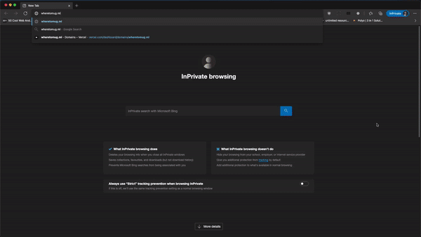

# Where To Mug

<!-- TABLE OF CONTENTS -->
<details open="open">
  <summary>Table of Contents</summary>
  <ol>
    <li><a href="#Introduction">Introduction</a></li>
    <li><a href="#demo">Demo</a></li>
    <li><a href="#Tech-Stack">Tech Stack</a></li>
    <li><a href="#Documentation">Documentation</a>
    <ul>
        <li><a href="#Folder-Structure">Folder Structure</a></li>
      </ul>
    </li>
    <li><a href="#Run-Locally">Run Locally</a></li>
    <li><a href="#Deployment">Deployment</a></li>
    <li><a href="#Environment-Variables">Environment Variables</a></li>
    <li><a href="#API-Reference">API Reference</a></li>
    <li><a href="#acknowledgements">Acknowledgements</a></li>
    <li><a href="#Feedback">Feedback</a></li>
    <li><a href="#Authors">Authors</a></li>
  </ol>
</details>

# Introduction

Ever wonder which tutorial room is free\* and which is not? 🤨

This tool could help you find out your dream tutorial room 🥳

Search which tutorial room is free by:

- day of the week
- room name
- time slot
- cluster

The website is mobile respondsive too!!

Link to website:
[https://wheretomug.ml/](https://wheretomug.ml/)

## Demo



## Tech Stack

**Client:** NextJs, ChakraUI

**Server:** NextJs API routes, Vercel

**Others:** EmailJs, SentryIO

We used EmailJs to collect feedbacks and SentryIO to log errors encountered by users.

## Documentation

### Folder Structure

```
    which-room-free/
    ├─📁 data
    │ ├─ rooms_with_cluster.json        //Rooms with cluster info
    │ ├─ room_ids.json                  //Rooms with IDs info
    │ ├─ room_occupancy.json            //Rooms with occupancy info
    ├─📁 public
    │ ├─📁 assets
    │ │ ├─ room_not_found_image.svg     //Svg image for room not found
    │ │ ├─ study_modal_image.svg        //Svg image for intro modal
    ├─📁 src
    │ ├─📁 components
    │ │ ├─ ScrollToTop.js               //Scroll to top button
    │ │ ├─ DisclaimerModel.tsx
    │ │ ├─ Feedback.js                  //Feedback form
    │ │ ├─ FilterOptions.tsx            //Room filter
    │ │ ├─ FreeRoomCard.tsx             //Individual room card
    │ │ ├─ FreeRoomsCardList.tsx        //List of room cards
    │ │ ├─ Main.tsx                     //Component for main page
    │ │ └─ RoomNotFound.tsx             //Room not found component
    │ ├─📁 pages
    │ │ ├─📁 api
    │ │ │ └─ index.js                   //API to filter rooms
    │ │ └─ index.tsx                    //Main page
    │ └─ theme.tsx                      //Styling for the website
    └─README.md
```

## Run Locally

Clone the project

```bash
  git clone https://github.com/OkkarMin/where-to-mug
```

Go to the project directory

```bash
  cd where-to-mug
```

Install dependencies

```bash
  npm install
```

Start the server

```bash
  npm run dev
```

## Deployment

3 step process to deploying the site properly on vercel

- Fork this repository into your own GitHub account.
- Using vercel, deploy the repository. [Learn how to deploy on vercel](https://vercel.com/docs/introduction)
- Put in the following enviornment variables. [Learn how to add env variables on vercel](https://vercel.com/docs/environment-variables)

## Environment Variables

To run this project, you will need to add the following environment variables to your .env file

`EMAILJS_TEMPLATE_ID`

`EMAILJS_USER_ID`

`EMAILJS_SERVICE_ID`

`SENTRY_SERVER_INIT_PATH`

`SENTRY_UR`

`SENTRY_ORG`

`SENTRY_PROJECT`

`SENTRY_AUTH_TOKEN`

## API Reference

#### Get filtered rooms

```http
  GET /api?currentDay=${currentDay}&timeSlot=${timeSlot}&searchText=${encodedSearchText}&cluster=${cluster}
```

| Parameter    | Type     | Description     |
| :----------- | :------- | :-------------- |
| `currentDay` | `string` | target day      |
| `timeSlot`   | `string` | target timeSlot |
| `searchText` | `string` | target Room     |
| `cluster`    | `string` | target cluster  |

## Acknowledgements

-  [kenrick95](https://github.com/kenrick95/plan/tree/master/back_end/data/parsed/json) for the rooms data
-  [Raymond](https://github.com/Cozinater) for the project idea
-  [Kayle](https://github.com/HJunyuan) for improvement suggestions
-  [JiaYin](https://github.com/lhinjy) for helping test and provide ui related feedback
-  [Cherie](https://github.com/cheriechh) for writing the disclaimer model

## Feedback

If you have any feedback, please raise an issue in this repository

or

Write in to us using the feedback from, located at the bottom right of the [website](https://wheretomug.ml/)

## Authors

- [@YingSheng](https://yeowys.com)
- [@OkkarMin](https://okkarm.in)
